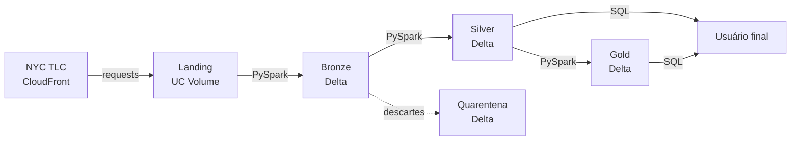

# Case Técnico — Data Architect | iFood

Pipeline de ingestão, disponibilização e análise dos dados de corridas de
*yellow taxi* da cidade de Nova York (NYC TLC), de janeiro a maio de 2023.

**16.180.102 corridas** processadas, disponibilizadas para consulta SQL e
analisadas para responder às duas perguntas do case.

| Entregável | Onde |
|---|---|
| Respostas às perguntas | [`analysis/respostas.md`](analysis/respostas.md) |
| Análise exploratória e regras de limpeza | [`docs/achados-eda.md`](docs/achados-eda.md) |
| Pipeline | [`src/`](src/) e [`notebooks/`](notebooks/) |

---

## Arquitetura



Arquitetura *medallion* sobre Delta Lake, com metadados e governança no Unity
Catalog.

| Camada | Objeto | Responsabilidade |
|---|---|---|
| **Landing** | `/Volumes/workspace/raw/landing` | Arquivos originais, byte a byte, sem interpretação. |
| **Bronze** | `workspace.bronze.yellow_tripdata` | Schema da origem com tipos canonizados + auditoria. Nenhum registro filtrado. |
| **Silver** | `workspace.silver.fact_yellow_trips` | Camada de consumo. Limpa, tipada, com colunas derivadas e sinalizações. |
| **Quarentena** | `workspace.silver.fact_yellow_trips_quarantine` | Registros descartados, com o motivo. |
| **Gold** | `workspace.gold.*` | Agregações que respondem às perguntas do case. |

### Por que quatro camadas

Cada uma resolve um problema que a anterior não pode resolver:

- A **landing** permite reprocessar tudo sem depender de a origem estar no ar, e
  torna auditável qualquer decisão de limpeza feita adiante. Guarda uma versão
  por competência: um novo download com tamanho divergente sobrescreve o
  arquivo, e o manifesto registra a substituição. Versionar as versões
  anteriores exigiria caminho por data de ingestão, o que não foi implementado.
- A **bronze** torna os arquivos consultáveis por SQL sem ainda tomar decisão
  nenhuma sobre o conteúdo.
- A **silver** aplica as regras de qualidade e entrega o dado pronto para
  consumo genérico.
- A **gold** materializa interpretações específicas, que são descartáveis e
  reconstruíveis, ao contrário das camadas abaixo.

---

## Decisões técnicas

### Plataforma

**Databricks Free Edition.** O case recomenda o Community Edition, aposentado no
fim de 2025. O Free Edition é o substituto e traz Unity Catalog nativo, o que
permite governança de verdade (catálogo, schema, volume, permissionamento) em
vez de arquivos soltos.

**Catálogo `workspace`.** O Free Edition não permite criar catálogo novo, por
falta de *storage credential*. Em ambiente real haveria catálogo por domínio e
por ambiente (`ifood_dev`, `ifood_prod`); aqui os schemas ficam sob `workspace`.

**Restrições do compute serverless.** Três limitações do ambiente afetaram o
código e estão tratadas explicitamente:

| Limitação | Contorno adotado |
|---|---|
| `input_file_name()` não suportado | `_metadata.file_path` |
| `.cache()` / `PERSIST` não suportado | Contagens lidas do log de transação Delta |
| Criação de catálogo bloqueada | Schemas sob o catálogo `workspace` |

### Modelagem

**`TIMESTAMP_NTZ` preservado.** A origem entrega os horários como
`timestamp_ntz` (*no time zone*), e está correta: a TLC registra hora local de
Nova York, sem *offset*. Converter para `TIMESTAMP` faria o Spark interpretar o
horário de parede no fuso da sessão, criando dependência implícita de
configuração. A pergunta 2 do case é justamente sobre hora do dia.

**Competência derivada da corrida, nunca do arquivo.** A análise exploratória
mostrou que os cinco arquivos mensais contêm corridas de **17 meses distintos**,
e que cada competência recebe corridas de **dois ou três arquivos diferentes**.
Agrupar por arquivo de origem produziria resposta errada. A partição da bronze
chama-se `_ref_period` ("referência do arquivo") para manter essa distinção
explícita; a silver particiona por `pickup_year_month`, derivado da data real.

**`double` para valores monetários, com ressalva.** Os tipos canônicos espelham
a origem, onde `total_amount` é `double`. Para valores monetários o tipo correto
seria `DECIMAL(10,2)`: somar 16 milhões de valores em ponto flutuante acumula
erro de arredondamento, e comparações de igualdade com dinheiro em `double` são
traiçoeiras. Os números apresentados estão arredondados a duas casas e o erro
acumulado é irrelevante nessa precisão, mas em um sistema financeiro real a
canonização seria para `DECIMAL`.

**CAST no plano do Spark, não no leitor de Parquet.** Os arquivos mensais não
têm schema estável: a mesma coluna aparece como `int32` num mês e `int64`
noutro. A leitura é feita arquivo por arquivo, com conversão posterior ao tipo
canônico, o que evita `SchemaColumnConvertNotSupportedException`.

### Qualidade de dados

**Descartar apenas o comprovadamente inválido.** A silver remove 6.284
registros (**0,039% da base**) em duas categorias: corrida fora do escopo
temporal (104) e corrida com duração não-positiva (6.180). Tudo o mais é
preservado e **sinalizado** em colunas `flag_*`.

O caso mais relevante são os 143.792 lançamentos com `total_amount` ≤ 0 na
silver. A interpretação usual é que sejam reversões e ajustes contábeis, mas o
dataset não traz campo que identifique reversão nem chave que permita parear um
lançamento negativo com a corrida que ele corrigiria: é hipótese de negócio, não
fato observado. Por isso são preservados e sinalizados como
`flag_valor_nao_positivo`, e a resposta oficial do case é a literal, com todos os
registros.

**Nada é descartado silenciosamente.** O que sai da silver vai para uma tabela
de quarentena com o motivo, e a validação confere que silver + quarentena
somam exatamente o total da bronze.

O dimensionamento de cada problema, com o número que o sustenta, está em
[`docs/achados-eda.md`](docs/achados-eda.md).

### Engenharia

**Idempotência em todas as camadas, verificada empiricamente.** A landing
compara o tamanho com a origem antes de baixar; a bronze usa `replaceWhere` por
partição. O notebook `02_bronze` inclui a consulta que prova a propriedade:
executar a carga duas vezes não produz partição com dois lotes de ingestão.

**A silver é reconstruída por completo, por decisão de escopo.** Como a silver é
particionada pela data real da corrida e a bronze pelo arquivo de origem, uma
corrida de março pode estar em qualquer arquivo: qualquer estratégia incremental
precisaria ler toda a bronze para localizar as linhas de uma competência.

A carga incremental continua viável — bastaria identificar as competências
afetadas e sobrescrever apenas essas partições com `replaceWhere`, economizando
na escrita. Com 16 milhões de registros a reconstrução leva segundos, e a versão
simples é mais previsível e mais fácil de auditar. Em produção, com volume
maior, a escrita seletiva compensaria.

**Lógica em módulos, não em notebooks.** Os notebooks apenas orquestram e
validam; toda regra vive em `src/`, versionada, revisável em *pull request* e
coberta por testes. Notebook que concentra regra de negócio não é nenhuma dessas
coisas.

**As regras de qualidade têm testes.** Cada decisão de descarte ou sinalização
tem um teste correspondente, com dados sintéticos, o que protege contra
regressão silenciosa nas regras de negócio. A cobertura para no limite da
lógica pura: escrita Delta, `replaceWhere` e conservação após gravação
permanecem validados por consulta manual nos notebooks.

**Linhagem registrada.** A landing mantém um manifesto (`JSONL`) com origem,
destino, tamanho, *checksum* SHA-256 e horário de cada arquivo ingerido, e cada
linha da bronze carrega `_source_file` e `_ingested_at`. As tabelas Delta guardam
o histórico de transações. Isso permite rastrear qualquer registro até o arquivo
que o originou e até a execução que o gravou. O elo que falta para rastreabilidade
completa é o checksum na linha: como o manifesto guarda uma entrada por
competência, uma republicação silenciosa da origem com o mesmo tamanho não seria
detectada.

---

## Respostas

### Pergunta 1 — média de `total_amount` por mês

O enunciado admite duas leituras, com respostas separadas por seis ordens de
grandeza. Ambas são entregues:

| Leitura | Resposta | Sem lançamentos não-positivos |
|---|---|---|
| **(a)** Ticket médio por corrida | **US$ 27,79** (simples) / **US$ 27,84** (ponderada) | US$ 28,26 / US$ 28,30 |
| **(b)** Faturamento mensal da frota | **US$ 90.120.269,65** | US$ 90.780.494,37 |

A resposta em negrito é a **literal**: todos os registros da camada de consumo.
A coluna à direita exclui os 143.792 lançamentos com `total_amount` ≤ 0 e
pressupõe que representem reversões ou ajustes, interpretação que os dados não
comprovam. É análise de sensibilidade, não a resposta.

### Pergunta 2 — média de passageiros por hora (maio/2023)

A média varia de **1,2348** (6h) a **1,4367** (2h), amplitude de 16,4%.

O padrão tem três fases: ocupação alta na madrugada (uso social, grupos
retornando juntos), vale no início da manhã (deslocamento individual para o
trabalho) e recuperação progressiva ao longo do dia.

Tabelas completas, decisões de tratamento e observações em
[`analysis/respostas.md`](analysis/respostas.md).

---

## Execução

### Databricks (recomendado)

1. **Workspace → Create → Git folder**, apontando para este repositório
2. Executar os notebooks na ordem:

```
01_landing  →  02_bronze  →  04_silver  →  05_analise_gold
```

**Nenhuma preparação manual é necessária.** Os schemas (`raw`, `bronze`,
`silver`, `gold`), o Volume da landing e todas as tabelas são criados pelo
próprio pipeline, com `CREATE ... IF NOT EXISTS`. O `01_landing` prepara o
catálogo antes do download, então basta executar os notebooks na ordem.

Nenhuma dependência precisa ser instalada: o runtime já provê PySpark, Delta e
`requests`.

O catálogo padrão é `workspace`, que existe em qualquer workspace do Free
Edition. Para usar outro, defina `IFOOD_CATALOG` na primeira célula de
`_setup.py`.

O notebook `03_eda` é opcional: documenta a investigação que fundamentou as
regras de limpeza. Fica fora de qualquer execução automatizada porque análise
exploratória é investigação humana, não etapa de pipeline.

### Local

Requer **JDK 8, 11 ou 17** (o PySpark 3.5 não funciona em Java 21+) e ~1 GiB de
disco.

```bash
python -m venv .venv && source .venv/bin/activate
pip install -r requirements.txt

python -m src.ingestion.landing    # origem  -> landing
python -m src.transform.bronze     # landing -> bronze
python -m src.transform.silver     # bronze  -> silver
python -m src.transform.gold       # silver  -> gold
```

### Testes

**No Databricks:** execute `notebooks/00_testes.py`. A fixture reaproveita a
sessão do runtime, então as regras são validadas no mesmo ambiente em que o
pipeline roda.

**Localmente:**

```bash
pip install -r requirements.txt
pytest                                  # suíte completa (requer JDK 8/11/17)
pytest tests/test_config_e_ingestao.py  # não cria SparkSession, mas importa pyspark
```

São 32 funções de teste, expandidas em 47 casos pelos parametrizados, cobrindo
as funções puras e as regras de qualidade da silver. Os que verificam a
classificação de registros usam uma `SparkSession` local e dados sintéticos, sem
exigir os arquivos da TLC.

Os testes cobrem as regras de classificação: que corrida fora do escopo é
descartada, que lançamento não-positivo é sinalizado e **não** descartado, que a
competência vem da data da corrida e não do arquivo, que nulo de
`passenger_count` não vira zero.

**O que não está coberto:** as operações de I/O e Delta. Não há teste de
integração que leia um Parquet real, exercite o `replaceWhere` da bronze ou
verifique a conservação após as escritas. Essas validações continuam sendo
consultas manuais nos notebooks.

A validação de colunas obrigatórias é testada como função pura
(`check_required_columns`), o que cobre a regra mas não prova que `read_landing`
a invoca. Um teste de integração exigiria gravar um Parquet, e o compute
serverless bloqueia escrita fora dos Volumes do Unity Catalog.

### Variáveis de ambiente

| Variável | Padrão | Descrição |
|---|---|---|
| `IFOOD_ENV` | detectado | `databricks` ou `local` |
| `IFOOD_CATALOG` | `workspace` / `spark_catalog` | Catálogo do metastore |
| `IFOOD_LOCAL_ROOT` | `./data` | Raiz de dados em execução local |

---

## Estrutura

```
├─ analysis/
│  └─ respostas.md          # Respostas às perguntas do case
├─ docs/
│  └─ achados-eda.md        # Análise exploratória e regras de limpeza
├─ notebooks/               # Orquestradores (Databricks)
│  ├─ _setup.py             # Configuração compartilhada (%run)
│  ├─ 00_testes.py          # Suíte de testes
│  ├─ 01_landing.py         # Origem  -> Volume
│  ├─ 02_bronze.py          # Landing -> Delta
│  ├─ 03_eda.py             # Análise exploratória (opcional)
│  ├─ 04_silver.py          # Bronze  -> Silver
│  └─ 05_analise_gold.py         # Respostas em SQL e PySpark
├─ src/
│  ├─ config.py             # Configuração central (isola local x Databricks)
│  ├─ ingestion/landing.py  # Download idempotente + manifesto
│  ├─ transform/
│  │  ├─ bronze.py          # Tipos canônicos + auditoria
│  │  ├─ silver.py          # Limpeza, sinalização, quarentena
│  │  └─ gold.py            # Agregações do case
│  └─ utils/spark.py        # SparkSession e namespaces
├─ tests/
│  ├─ test_config_e_ingestao.py  # Caminhos, schema, idempotência
│  └─ test_silver_regras.py      # Regras de qualidade (requer PySpark)
├─ pytest.ini
├─ requirements.txt
└─ README.md
```

Os notebooks são salvos como `.py` com o cabeçalho `# Databricks notebook source`:
renderizam como notebook no workspace, mas produzem *diff* legível no Git, ao
contrário de `.ipynb`, cujo JSON com *outputs* embutidos é ilegível em revisão.

---

## Sobre os dados

Fonte: **NYC Taxi & Limousine Commission — TLC Trip Record Data**
<https://www.nyc.gov/site/tlc/about/tlc-trip-record-data.page>

Os arquivos são servidos pelo CDN `d37ci6vzurychx.cloudfront.net`, que é a
origem real utilizada pelo pipeline. As colunas exigidas pelo case
(`VendorID`, `passenger_count`, `total_amount`, `tpep_pickup_datetime` e
`tpep_dropoff_datetime`) estão presentes na camada de consumo, junto com as
demais colunas da origem e com colunas derivadas (`pickup_date`, `pickup_hour`,
`pickup_day_of_week`, `trip_duration_seconds`).
